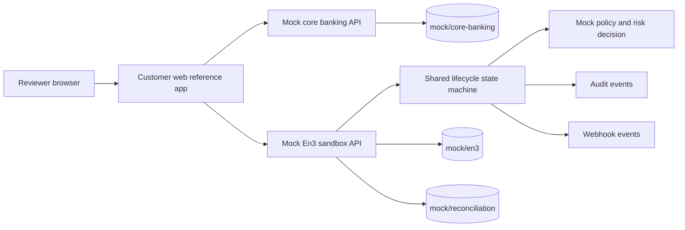

# En3 Reference Bank

Status: public reference / sandbox artifact. This repository demonstrates how a bank or
fintech could use En3-style sandbox APIs to launch a stablecoin wallet product. It is not
production banking, custody, signing, ledger, treasury, compliance, or deployment
infrastructure.

All customers, accounts, wallets, addresses, transactions, audit events, webhook events,
and reconciliation records are mock data. No real funds move.

## What This Repo Demonstrates

1. A bank customer exists in mock core banking.
2. An En3 sandbox wallet is created or displayed for the customer.
3. A sandbox deposit address is issued.
4. A stablecoin deposit is detected in mock form.
5. The user balance is credited in mock state.
6. An outgoing payment is submitted.
7. The transaction is simulated.
8. Policy requires approval for a high amount or risky mock destination.
9. Admin approval is recorded.
10. The transaction is mock-signed and mock-broadcast.
11. The transaction settles in the reference lifecycle.
12. Reconciliation links the core account, wallet, transaction, and audit events.
13. Audit events record the lifecycle.
14. Webhook events show outbound notifications.

## Run Locally

Prerequisites:

- Node.js 20+
- pnpm 9+

```bash
pnpm install
pnpm dev
```

Open `http://localhost:5173`.

Local services:

- Customer web demo: `http://localhost:5173`
- Mock core banking API: `http://localhost:4100`
- Mock En3 sandbox API: `http://localhost:4101`

Useful checks:

```bash
curl http://localhost:4100/customers
curl http://localhost:4101/demo/state
curl http://localhost:4101/reconciliation/report
```

## Architecture



## 5-Minute Demo Script

1. Open the web demo and select `Maya Reference`.
2. Show the active sandbox wallet, USDC balance, and deposit address.
3. Open the timeline and point out the mock deposit detection and credit.
4. Submit the default `11000.00 USDC` outgoing payment to the risky mock destination.
5. Show the simulation result and approval requirement.
6. Click `Approve mock transaction`.
7. Show mock signing, mock broadcast, settlement, reconciliation, audit events, and
   webhooks.
8. Use the reset button to return to the seeded reference scenario.

## Project Layout

```text
apps/customer-web      Vite React demo UI
apps/mock-bank-core    Local mock core-banking API
apps/mock-en3-api      Local mock En3 sandbox API
packages/shared        Scenario state machine, types, and tests
mock/                  Public seed data
docs/                  Architecture and scenario walkthroughs
specs/                 Spec Kit artifacts
```

## Documentation

- [Architecture](docs/architecture.md)
- [Demo script](docs/demo-script.md)
- [Scenario 01: create user wallet](docs/scenarios/01-create-user-wallet.md)
- [Scenario 02: deposit stablecoin](docs/scenarios/02-deposit-stablecoin.md)
- [Scenario 03: send payment with policy](docs/scenarios/03-send-payment-with-policy.md)
- [Scenario 04: approve high-risk transaction](docs/scenarios/04-approve-high-risk-transaction.md)
- [Scenario 05: reconcile payment](docs/scenarios/05-reconcile-payment.md)
- [Spec Kit plan](specs/001-reference-bank-stablecoin-wallet-demo/plan.md)

## Related En3 Repositories

- [en3-api-spec](https://github.com/en3-finance/en3-api-spec)
- [en3-wallet-sdk](https://github.com/en3-finance/en3-wallet-sdk)
- [en3-admin-console](https://github.com/en3-finance/en3-admin-console)
- [en3-docs](https://github.com/en3-finance/en3-docs)

## Boundaries

This repository intentionally excludes production cryptography, MPC/TSS, signing
orchestration, policy enforcement, risk logic, ledger infrastructure, treasury execution,
customer deployments, private endpoints, real RPC URLs, vendor integrations, and compliance
certifications. Any production deployment options described by En3 are outside this public
reference implementation unless explicitly implemented in code.
