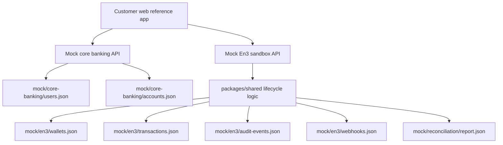

# Reference Bank Architecture

The reference bank combines mock core banking data with mock En3 sandbox API concepts. It
is designed for a local 5-minute walkthrough, not production deployment.

| Area | Public mock responsibility |
| --- | --- |
| Core banking | Sample customers and fiat account references. |
| En3 wallet layer | Sandbox wallets, deposit addresses, transaction lifecycle. |
| Control plane | Mock policy simulation, approval, and audit events. |
| Payment operations | Mock stablecoin deposit, outgoing payment, settlement, and reconciliation. |
| Compliance adapter | Mock address-risk state only; no vendor integration. |

## Runtime Services

- `apps/customer-web`: Vite React UI for customer, wallet, policy, timeline,
  reconciliation, audit, and webhook inspection.
- `apps/mock-bank-core`: Fastify service exposing mock customers and accounts.
- `apps/mock-en3-api`: Fastify service exposing sandbox wallet, transaction, approval,
  audit, webhook, reconciliation, and reset endpoints.
- `packages/shared`: TypeScript types and lifecycle state machine used by services and
  tests.

## Security Boundary

Production custody, signing infrastructure, policy enforcement, risk logic, ledger
infrastructure, treasury execution, and customer deployments are not contained in this
repository. Mock signing and mock broadcast are lifecycle labels only.
