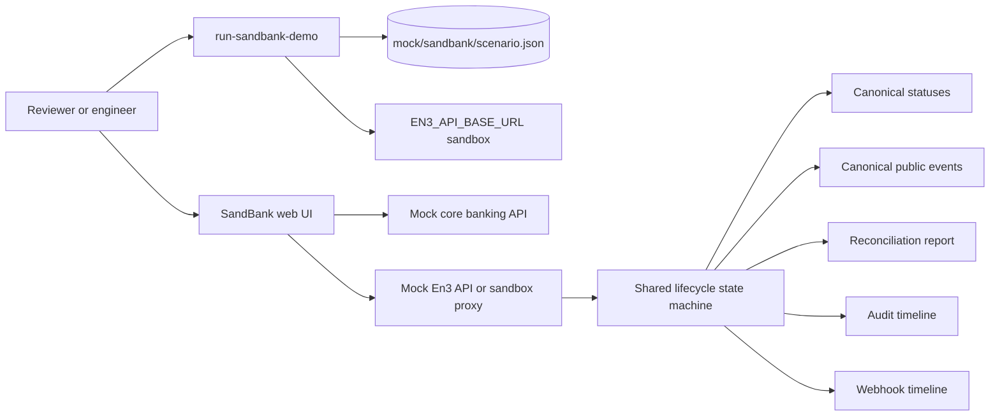

# SandBank Architecture

SandBank is a public demo composed of a React UI, mock APIs, a shared lifecycle state machine, and a CLI runner. Mock mode is fully local. Live sandbox mode is selected only by `EN3_API_BASE_URL`.

## Components

| Component | Responsibility |
| --- | --- |
| `scripts/run-sandbank-demo.mjs` | Prints the required end-to-end lifecycle in mock mode or live sandbox mode. |
| `mock/sandbank/scenario.json` | Synthetic public SandBank lifecycle data. |
| `packages/shared` | Canonical statuses/events, lifecycle state machine, and tests. |
| `apps/mock-bank-core` | Local synthetic customer and account API. |
| `apps/mock-en3-api` | Local mock wallet, payment, approval, audit, webhook, and reconciliation API. |
| `apps/customer-web` | Browser demo using mock APIs or `EN3_API_BASE_URL` proxy. |

## Public Boundary

The architecture intentionally avoids private platform code. Signing, broadcast, policy, risk, ledger, custody, treasury, and reconciliation are modeled only as mock or sandbox demo states. There are no real keys, real RPC endpoints, production customer data, or private deployment details.
